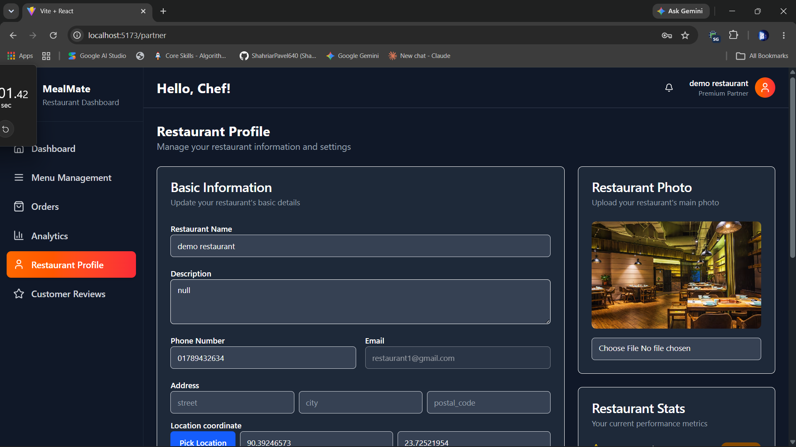
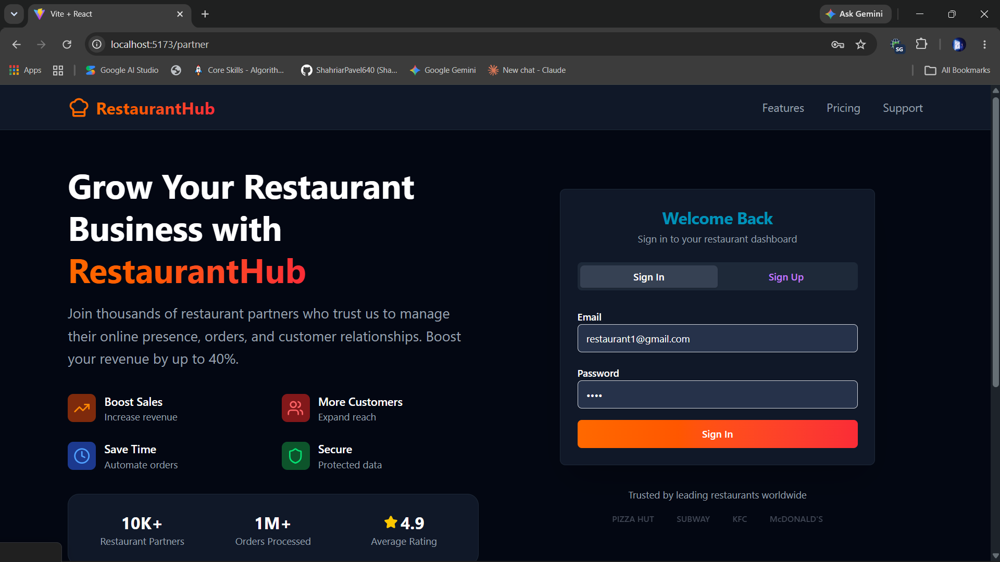
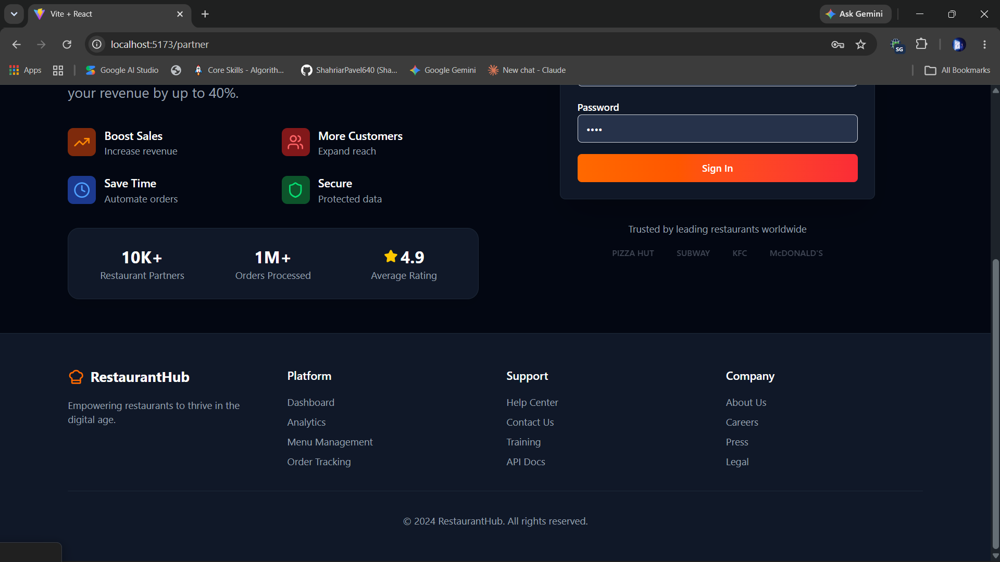
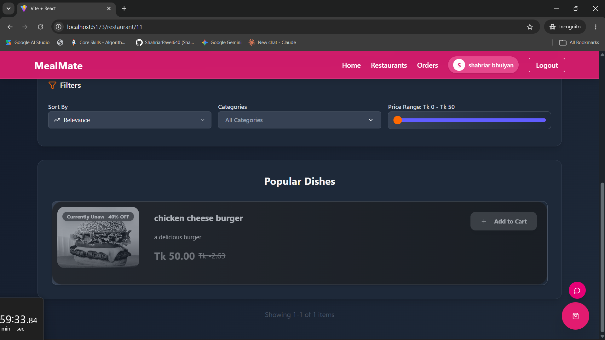
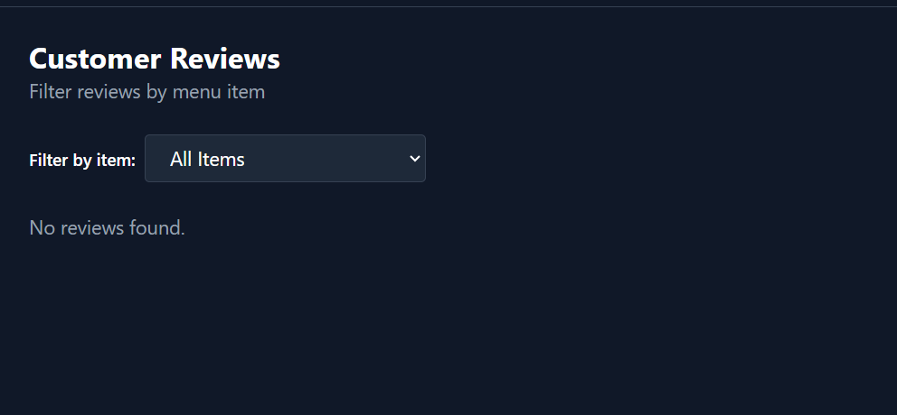
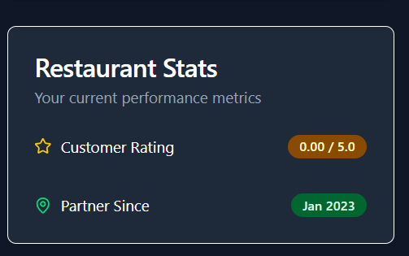
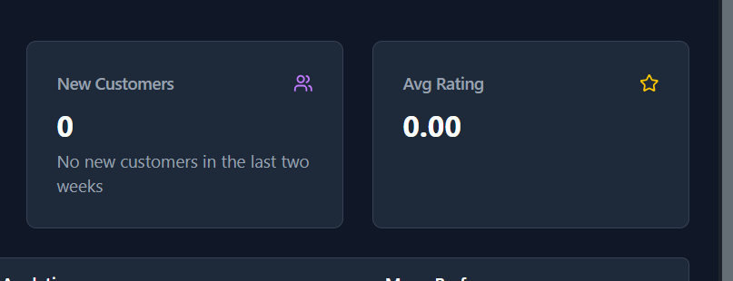
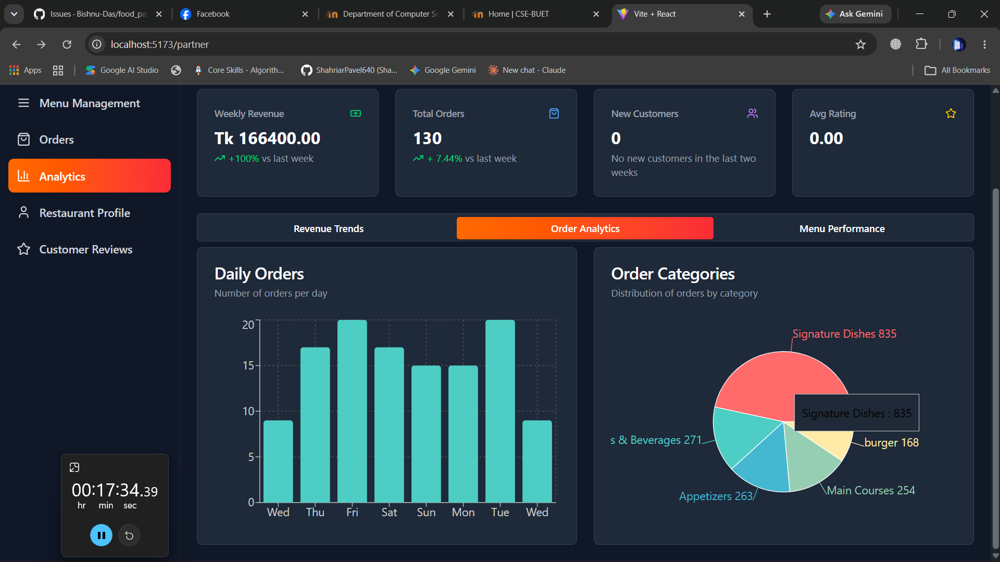

1) fix -1:  currently the delivery fee is hardcoded from the frontend. the delivery fee should be calculated dynamically. if there are multiple restaurants, delivery fee would be calculated according to the restaurant numbers. will will set default delivery fee for one restaurant = 30, if there are multiple orders in a cart delivery fee will be multiplied. (done)
2) 
3) fix - 2 : remove all the dollar sign and replace with Tk in the restaurant(done)
4) 
5) fix - 3: check if restaurant is available or not at first(done)
6) 
7) fix -  4 : fix the notification button. when i click on the notification button on the restaurant/partner page it shows all the notification. but if i click the notification button again/press clear all the component should disappear.
8) 
9) fix - 5 : add more interactivity to the ui
10) 
11) fix - 6 : description is showing null by default in edit profile section ( solved )
12) 
13) 7) 

       fix - 7  : check if this page is perfect for the application or not. if there is any  illocal/ hardcoded value let me know. make it professional and relevant.
    8) 
    9) 
14) fix - 8: why is this item card showing  negative value before discount applied? is this correct?

fix - 9: 
we don't have item wise review right now. so this option does not make any sense. we have review and rating for the whole restaurant. tell me if this is correct or should we modify this?

fix - 10: 
why is the rating not changing after populating the reviews and ratings? also tell me is the partner since date hardcoded currently?

fix - 11 : 
here also the average rating is not showing. also tell me how a new customer is added? we have seeded so many order still no new customer!

fix - 12: 

the text in the order categories matrix is not visible.
