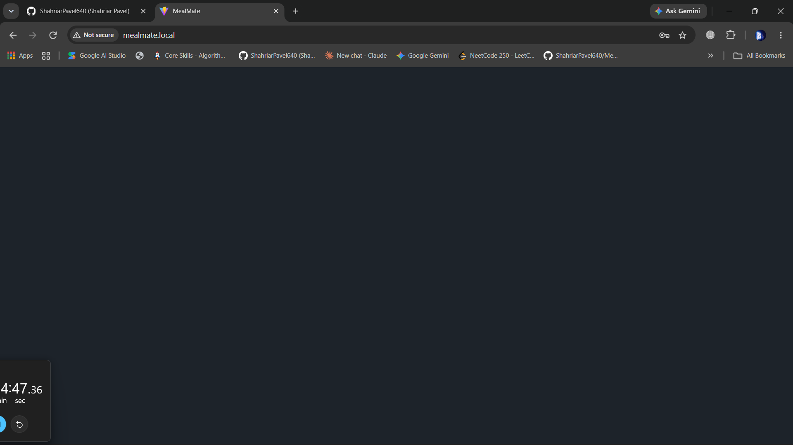
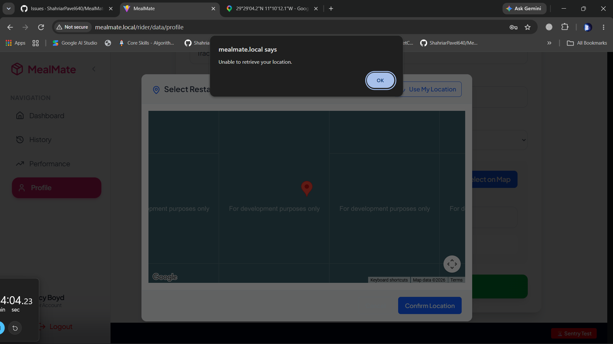

there are some issues with the k8s cluster that should be fixed:

1)this blank page occurs every time i log out from the customer interface

1. 

2)the db is not properly seeded prolly. go through the db_seed.md file on root. you will get to know what to do to seed the db properly. i want to get the data in real time to show the stats on the restaurant and rider dashboard. the stats is prolly generating properly. but the there is only one restautant shown on our demo customer( customer1@gmail.com ).  the issue is prolly with the operating hours of the operating hours of the seeded restaurants. update the seeded data if needed

3)generate with ai in the menu edit is not working properly.cannot update restaurant hours from the restaurant side.

5)cannot set edit location from the rider profile

8) 
9) 

6)there are so many errors showing on the ci.yml
