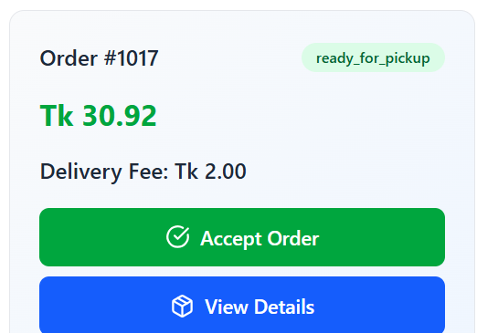
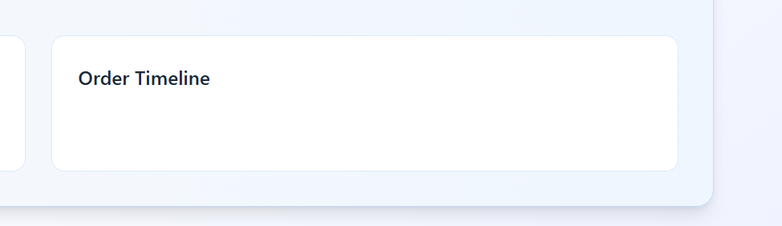
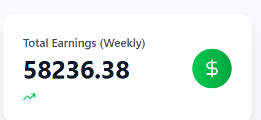
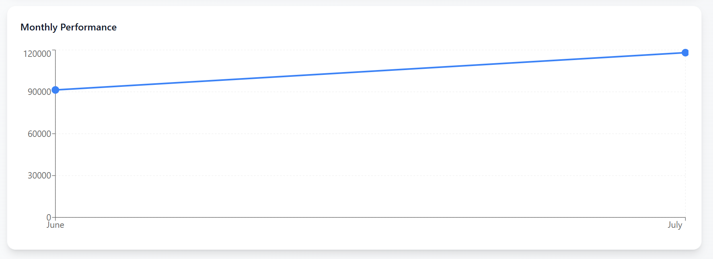

fix 1: why is the delivery fee showing 2 always. it should show the exact delivery fee the customer sees.

fix 2: tell me what this order timeline does? it is always empty!

fix 3: all the deliveries are showing at once in the delivery history. implement pagination both in the  backend and the frontend

fix 4:

remove the dollar sign and replace with Tk

fix 5: there is not pagination for reviews as well. need to implement pagination from the backend and the frontend here as well. tell me the best approach to deal with this

fix 6: when signing up/editing, the vehicle type should be an enum.

fix 7: 

this one should be highlighted so the user understands that he will see the  profile of the rider.

fix 8: 
need to populate data of several months to properly visualize this

fix 9:
