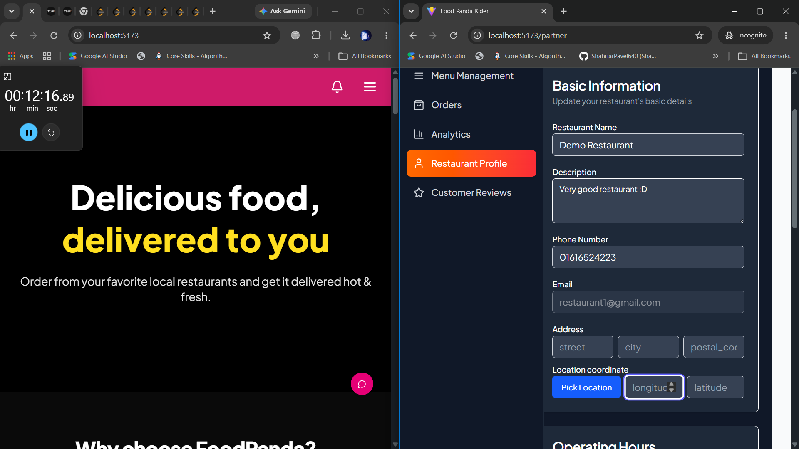
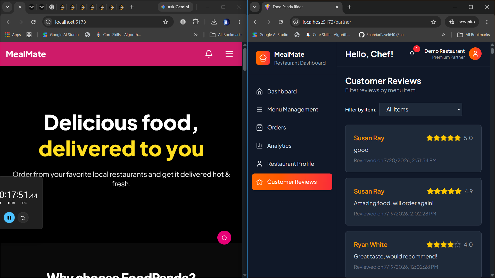
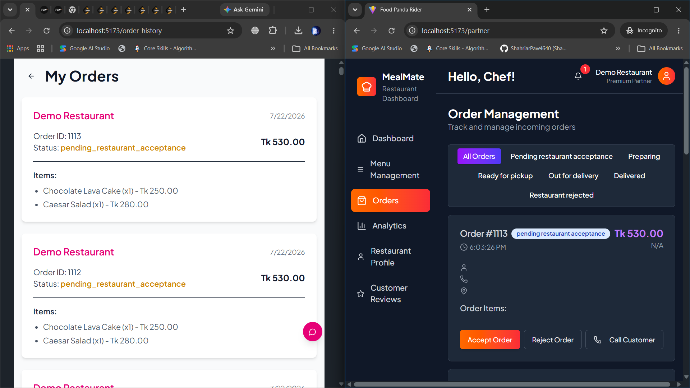

#1 

why is the latitute longitude not showing, still the restaurant receives order from the customer

#2 

we should remove the filter by menu items option as the review ratings are for the whole restaurant. not  for a particular menu item

#3

if there is an order placed and i land on the order page first time, i don't see the details like contact, location etc. as you can see in the image. just after refreshing the page, these fields get visible

#4

there is a singnificant flaw in the sslcommerz payment from the customer side. when i pay from cash on delivery it instantly send notifiction to the resaurant and the cart gets cleared. but when i pay with sslcommerz, cart state does not change after placing order and the restaurant does not receive any notification. why is it like this? these two feature should inherit a common interface right?
